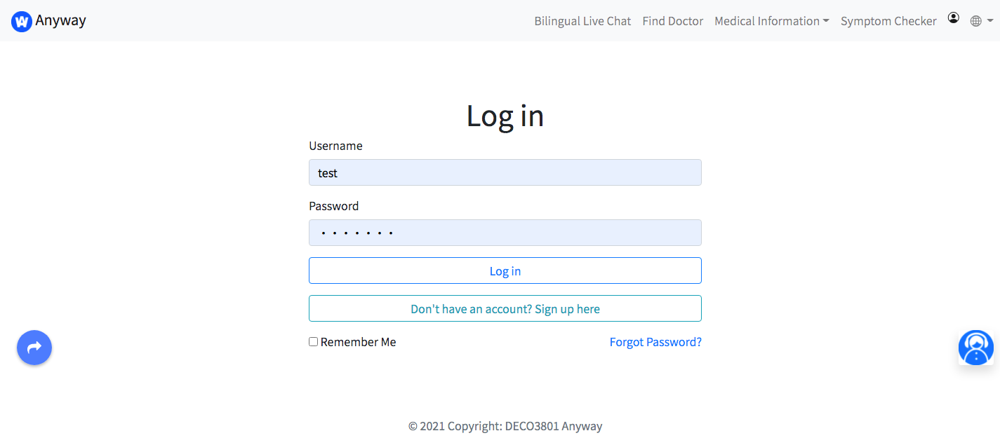

# DECO3801 Team Anyway

## Introduction

This is source code of ***Team Anyway*** for Design Computing Studio 3.

This project is based on ***Skyscraper*** proposal from DECO3800. It aims to help second-language speakers cope with their unfamiliarity with the Australian medical system due to language barriers. 

## Project Link

- Source Code are public in Github: https://github.com/hacker0limbo/deco3801-anyway
- Prototype of website including iterations is hosted on Figma: https://www.figma.com/file/FcfZVqjSxYiMDR4rtZ3M7A/Anyway

## Contributors

- [Junze Li](https://github.com/junzeLi) (s4518552, Team Leader)
- [Kexu Gu](https://github.com/Ryoug1) (s4583995, Back-end Developer)
- [Xin Chen](https://github.com/Gloria-CHEN4) (s4439219, Designer)
- [Xiaole Sun](https://github.com/Stephanie12138) (s4518671, Designer)
- [Weiting Yin](https://github.com/hacker0limbo) (s4462351, Front-end Developer)
- [Haolong Ding](https://github.com/TeRiRi-22) (s4584450, Front-end Developer)

## Setup

There are a few steps to follow to setup this project locally.

1. Download [XAMPP](https://www.apachefriends.org/)
2. Config XAMPP Apache web server port to `8080`
3. In terminal, change directory to `/Applications/XAMPP/xamppfiles/htdocs` and git clone our project
  ```bash
  $ cd /Applications/XAMPP/xamppfiles/htdocs
  $ git clone https://github.com/hacker0limbo/deco3801-anyway.git
  ```
4. Open our project in any editor and config `base_url` in `CI/application/config/config.php` as following:
  ```php
  $config['base_url'] = 'http://localhost:8080/deco3801-anyway/CI/';
  ```
5. Open [PhpMyAdmin](http://localhost:8080/phpmyadmin/) and create a new database `deco3801`
6. Run all `deco3801.sql` file content for this database, this will create necessary tables for this project
7. Open `http://localhost:8080/deco3801-anyway/CI/`, now you can see our website on browser

## Features

### Homepage

The [homepage page](http://localhost:8080/deco3801-anyway/CI/) contains navigation on the top, basic website information, and card navigation for better visualization as well.

User can choose to switch to Chinese mode by clicking the right top language selecting button.


## Login and Register

New user can register using the [sign up page](http://localhost:8080/deco3801-anyway/CI/signup). All personal information are encrypted in our database.


User who already done registration can go to [login page](http://localhost:8080/deco3801-anyway/CI/login) to login.



## Medical Information

The medical information aims to provide users a good overview of Australia's [medical service](http://localhost:8080/deco3801-anyway/CI/service) and [Medical insurance](http://localhost:8080/deco3801-anyway/CI/insurance).

For example, [Student Medical Insurance page](http://localhost:8080/deco3801-anyway/CI/insurance/student) demonstrates basic information about student medical insurance


## Find Doctor

In [booking page](http://localhost:8080/deco3801-anyway/CI/booking), users are able to see all available clinic and corresponding information such as opening hours based on his current location. 

This is implemented based on [Google Map API](https://developers.google.com/maps)


## Symptom Checker

The [online symptom checker](http://localhost:8080/deco3801-anyway/CI/checker) provide an online medical diagnosis system that user can do self check before they decide to see a doctor.

This is implemented using [Petite Vue](https://github.com/vuejs/petite-vue), [ApiMedic](https://apimedic.com/) and [Baidu Translation API](https://fanyi-api.baidu.com/api/trans/product/index)


## Bilingual Live Chat

User are able to consult with real stuff using our system by going to the [bilingual live chat page](http://localhost:8080/deco3801-anyway/CI/checker/livechat). You can review your chat history, ask questions using different languages and translate them into another language if you want.

This functionality is implemented using [TalkJS](https://talkjs.com/)


## Project Structure

CodeIgniter is a classic MVC PHP framework. Most of our work are located on those folders:
- `CI/application/views`: Our website views
- `CI/application/models`: Defined models
- `CI/application/controllers`: Controllers that connect views and models, contains most of back-end business logical
- `CI/assets`: static files including CSS, JavaScript and images.
- `deco3801.sql`: SQL file

## Technology Stack

Our project is a server-rendering Website, main technologies used in this project are listed below:
- UI Design:
  - [Figma](https://www.figma.com): The collaborative interface design tool
- Front-end:
  - [Petite Vue](https://github.com/vuejs/petite-vue): An alternative distribution of Vue optimized for progressive enhancement
  - [Bootstrap](https://getbootstrap.com/): A free and open-source CSS framework
  - [Bootstrap Stepper](https://github.com/Johann-S/bs-stepper): A stepper plugin for Bootstrap 4
- Back-end:
  - [CodeIgniter](https://codeigniter.com/): A powerful PHP MVC framework for web development
  - [XAMPP](https://www.apachefriends.org/): The most popular PHP development environment
  - [MySQL](https://www.mysql.com/): An open-source relational database management system
- API Used:
  - [Google Map API](https://developers.google.com/maps): a web mapping platform and consumer application offered by Google
  - [TalkJS](https://talkjs.com/): A Chat API with pre-built UI for web & mobile apps
  - [ApiMedic](https://apimedic.com/): A medical symptom checker API primarily for patients.
  - [Google Translation API](https://cloud.google.com/translate): Translation API developed by Google
  - [Baidu Translation API](https://fanyi-api.baidu.com/api/trans/product/index): Translation API developed by Baidu

## Improvements

During our developments, there are still some places that we can improve in the future:
- Cleaner commit message and commit records
- Uniformed coding style
- Better branch names
- Code review for each pull request if time is enough
- Detailed comments and better variable naming
- Integration testing
- More user testing and iterations